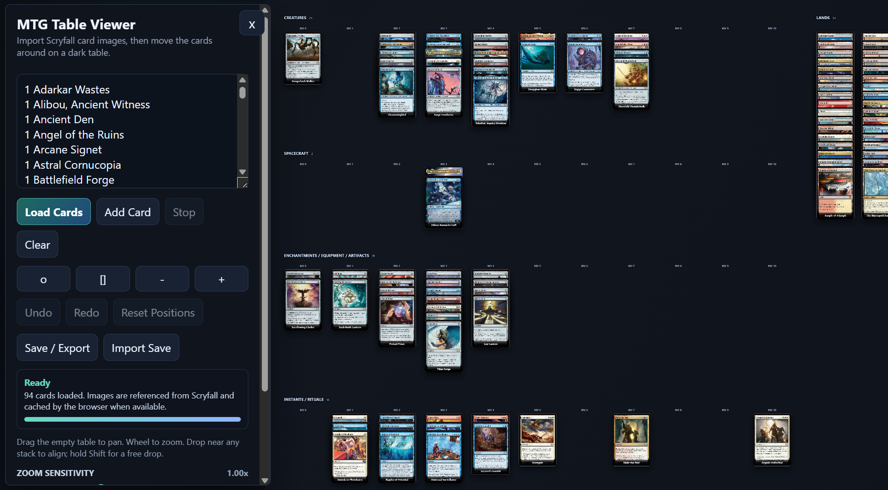
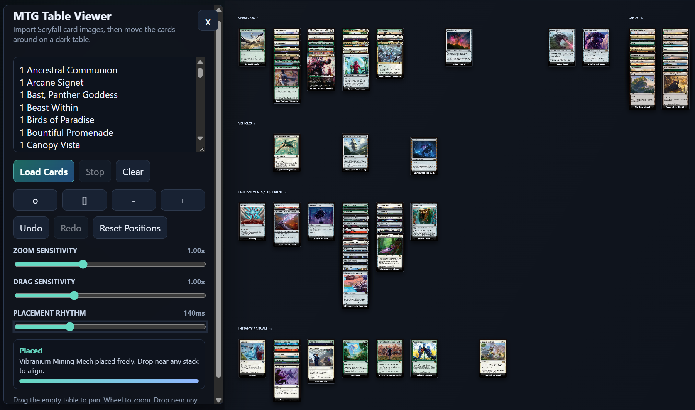

# MTG Deck Table Viewer

A single-file Magic: The Gathering table viewer for visually sorting a deck by card type and mana value, and move them around as you wish.

Paste a decklist, get cards images automatically loaded and categorized, then drag cards around on a tabletop.

It replicates manual sorting/viewing of physical cards.



## Features

- Imports card images from Scryfall by card name.
- Groups cards into creature, vehicle, spacecraft, planeswalker, enchantments/equipment/artifacts, instant/ritual, other, and land areas.
- Aligns non-land cards by mana value.
- Keeps lands on the right side of the table.
- Supports free dragging, stack snapping, and between-card insertion while preserving visible stack spacing.
- Shows a face switch on double-faced cards so you can view the other side.
- Lets held cards temporarily rise to the top for inspection, then return to their stack layer on release.
- Adds/removes individual cards.
- Asks before removing a card with right-click.
- Includes Undo, Redo, and Reset Positions controls. Undo stores the last five changes.
- Saves and imports `.mtg-viewer.json` bundles containing the decklist, card placement, and Scryfall image URLs, with optional embedded images for offline use.
- Provides pan, zoom, fit, and center controls for large deck layouts.



## Usage

Open `mtg-viewer.html` in a browser.

Paste a decklist in this format:

```text
1 Birds of Paradise
1 Sol Ring
1 Command Tower
```

The viewer loads one visual card per non-empty decklist line. Scryfall fetches are paced so large lists load steadily instead of hammering the API.

## Controls

- Drag a card to move it.
- Use Add Card to append one card to the current table.
- Right-click a card to remove it after confirmation.
- Drop near another card to snap into that stack.
- Hold Shift while dropping to place freely without snapping.
- Hold a card to bring it forward temporarily; release to return it to its stack layer.
- Use the small face number on double-faced cards, or double-click the card, to flip sides.
- Use Undo, Redo, and Reset Positions to manage manual layout and add/remove changes.
- Use Save / Export to write a portable table save to your device. Choose whether to embed images for offline imports.
- Use Import Save to reload a saved decklist, card placement, and either embedded images or Scryfall image URLs.

## Notes

This is a static HTML/CSS/JavaScript app. It does not require a build step or store deck data on a server.

Save files are plain JSON with the `.mtg-viewer.json` extension. Browsers that support the File System Access API open a save-location dialog; other browsers use their normal download flow. Saves always keep image URLs; embedding images makes the file larger but lets imports show cards offline.

Card data and images are loaded from the public Scryfall API. Magic: The Gathering card names, text, and images belong to their respective rights holders.

## AI Agent Skill

The repo also includes a separate Codex skill at `agent-skills/mtg-viewer-from-deck-images/`. It guides an AI agent through creating `.mtg-viewer.json` saves from physical deck photos, including language-preserving Scryfall images, duplicate audits, offline image embedding, and multi-face card images.

## Limitions

Opinionated automated categories (equivalent to one way I layout physical cards out to visualize a deck)

## To Dos
1. Dontrols for categories
2. Diverse deck stats visualization
3. Automated land sorting
