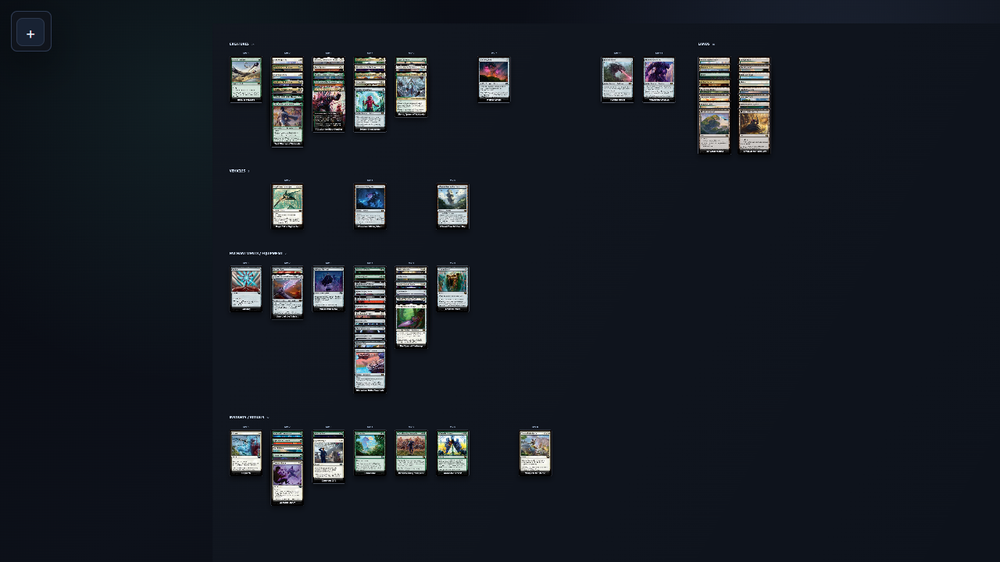
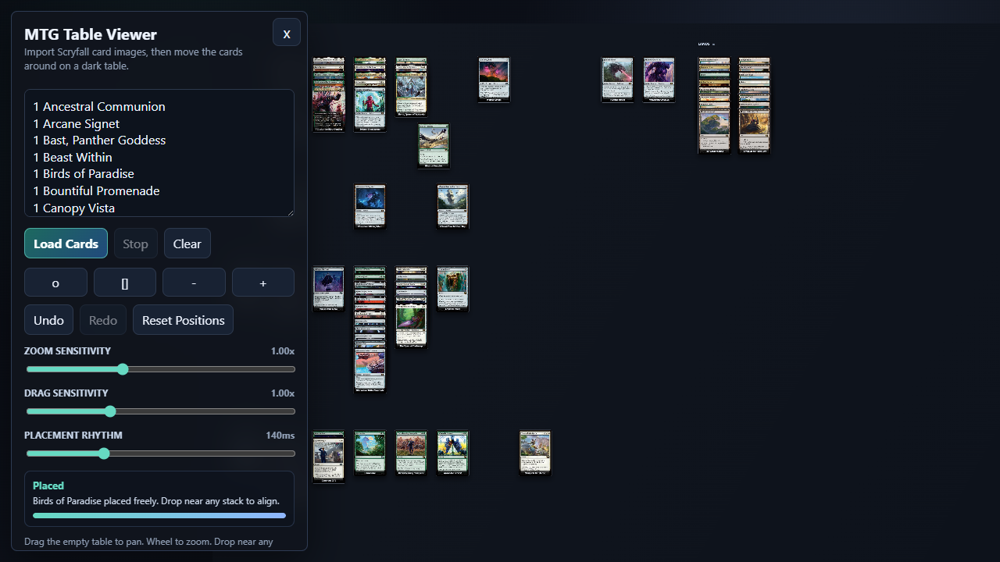

# MTG Table Viewer

A single-file Magic: The Gathering table viewer for visually sorting a deck by card type and mana value, and move them around as you wish.
Paste a decklist, get automatic card images loading from Scryfall and categoriziation, then drag cards around on a dark tabletop while the organized columns stay readable.



## Features

- Imports card images from Scryfall by card name.
- Groups cards into creature, vehicle, spacecraft, planeswalker, enchantment/equipment/artifact, instant/ritual, other, and land areas.
- Aligns non-land cards by mana value so MV 1 starts in the first column, MV 2 in the second, and so on.
- Keeps lands on the right side of the table.
- Supports free dragging, stack snapping, and between-card insertion while preserving visible stack spacing.
- Lets clicked cards temporarily rise to the top for inspection, then return to their stack layer when you click away.
- Includes Undo, Redo, and Reset Positions controls. Undo stores the last five moves.
- Provides pan, zoom, fit, and center controls for large deck layouts.



## Usage

Open `mtg-viewer.html` in a browser.

Paste a decklist in this format:

```text
1 Birds of Paradise
1 Sol Ring
1 Command Tower
```

The viewer loads one visual card per non-empty decklist line. Scryfall fetches are paced so large lists load steadily instead of hammering the API.

## Controls

- Drag a card to move it.
- Drop near another card to snap into that stack.
- Hold Shift while dropping to place freely without snapping.
- Click a card to bring it forward temporarily.
- Click empty table space or the controls panel to return a focused card to its stack layer.
- Use Undo, Redo, and Reset Positions to manage manual layout changes.

## Notes

This is a static HTML/CSS/JavaScript app. It does not require a build step or store deck data on a server.

Card data and images are loaded from the public Scryfall API. Magic: The Gathering card names, text, and images belong to their respective rights holders.
