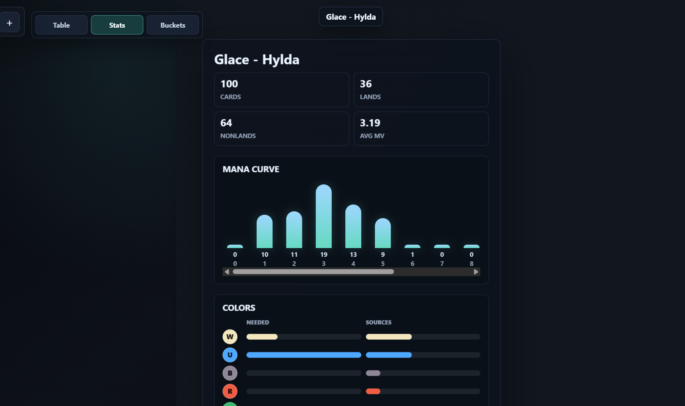
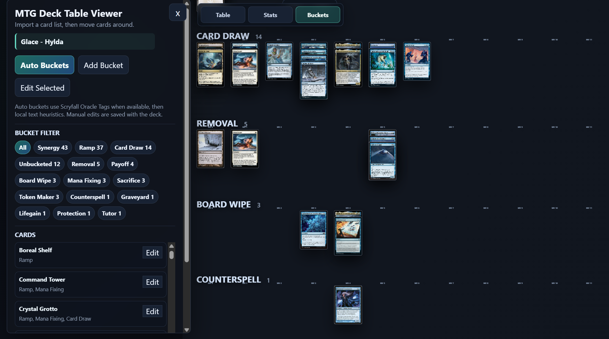
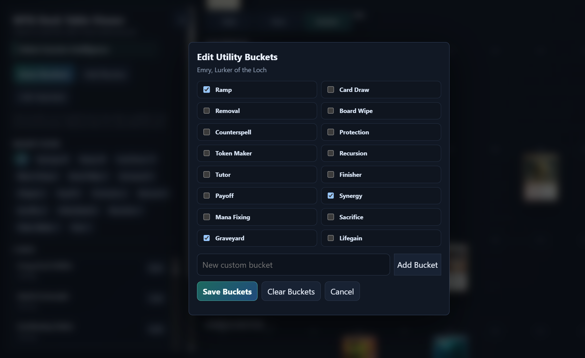
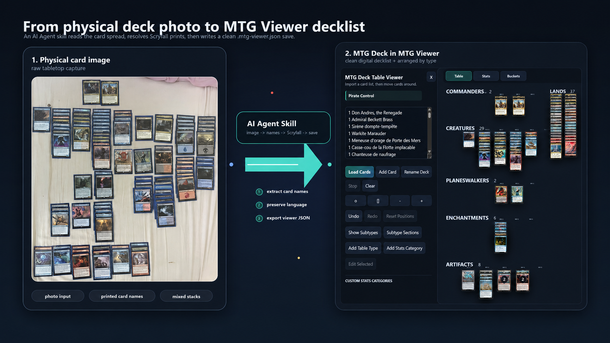

# MTG Deck Table Viewer

Version: v0.4

A single-file Magic: The Gathering deck viewer for organizing decks and visualizing their stats, with automation and intuitive UI.

Paste a decklist, get cards images automatically loaded and categorized, visualize the stats, then drag cards around and edit your deck.

It runs fully locally/offline once cards info and images are fetched.

Highly portable: single file browser app and single file deck save.

Associated AI Agent skill to create mtg-viewer compatible deck lists from images of physical cards.


## Features

4 tabs: Tabletop deck view, Stats, Utility buckets, and Strategy notes.

### Automated and interactive tabletop deck view
- Imports card images from Scryfall by card name or Scryfall ID.
- Imports `.csv` files exported by the MythicTools app after scanning a deck.
- Groups cards into creature, planeswalker, enchantment, artifact, instant, sorcery, others, and land areas by default.
- Can activate selected Scryfall-detected subtypes as extra tabletop rows, then show/hide those rows globally.
- Supports unlimited commander tags; commander-tagged cards appear in their own section under Creatures.
- Aligns non-land cards by mana value.
- Supports manually overriding the mana value (i.e., for X, XX cards you plan to ideally cast at a given MV).
- Keeps lands on the right side of the table and auto-sorts them into produced-mana stacks: Any Color, Colorless, single colors, and multicolor combinations.
- Supports free dragging, stack snapping, and between-card insertion while preserving visible stack spacing.
- Shows a face switch on double-faced cards so you can view the other side.
- Lets held cards temporarily rise to the top for inspection, then return to their stack layer on release.
- Adds/removes cards, with quantity support when adding cards.
- Includes Undo, Redo, and Reset Positions controls. Undo stores the last five changes.
- Saves and imports `.mtg-viewer.json` bundles containing the decklist, strategy notes, card placement, buckets, and Scryfall image URLs, with optional embedded images for offline use.
- Provides pan, zoom, fit, and center controls for large deck layouts.


### Deck stats
- Stats view for deck summary, mana curve, type counts, color demand/sources, utility bucket counts, and stats-only custom categories.
- Custom stats categories are edited from the Table tab and let you count tags such as Equipment without changing tabletop placement or utility buckets.



### Utility buckets
- Automated utility Buckets such as Ramp, Card Draw, Removal, Board Wipe, Protection, Tutor, Graveyard, +1/+1 Counter, LifeGain, etc. detected from Scryfall Oracle Tags.
- Land cards are excluded from the Ramp bucket and Ramp stats.
- Custom utility Buckets, with manual per-card or multi-card bucket editing.
- View that shows card references grouped by utility bucket, supports the same inspection/zoom behavior as the table, and lets you drag cards between buckets to edit assignments.





### Strategy notes
- Strategy tab for freeform piloting notes, game plan reminders, mulligan notes, key synergies, and sequencing notes.
- Strategy notes are saved inside `.mtg-viewer.json` files and restored on import.

## Usage

Open `mtg-viewer.html` in a browser.

Paste a decklist in this format:

```text
1 Birds of Paradise
1 Sirène dompte-tempête
1 Sol Ring
3 Mountain
1 Command Tower
```

The viewer accepts normal quantity prefixes such as `3 Mountain` or `3x Mountain`, and localized printed names with accents such as `Flibustière à voile volante` or `Persécuteur morne-œil`. Each copy becomes its own movable card on the table with a separate internal id. Scryfall fetches are paced so large lists load steadily instead of hammering the API.

You can also import a MythicTools scan export with **Import from MythicTools CSV**.

Use **Export mtg-viewer JSON** and **Import mtg-viewer JSON** for portable viewer-compatible saves.

## Controls

### Tabletop deck view
- Drag a card to move it.
- Use Add Card to append one or more cards to the current table by card name or Scryfall ID.
- Right-click a card to override its mana value, assign commander/table type/custom stats tags, or remove it after confirmation.
- Use Subtype Sections to activate detected subtypes by main type, then Show Subtypes to reveal only those activated subtype rows. Cards from that type that do not match an activated subtype appear in that type's Others row.
- Drop near another card to snap into that stack.
- Hold Shift while dropping to place freely without snapping.
- Hold a card to bring it forward temporarily; release to return it to its stack layer.
- Use the small face number on double-faced cards, or double-click the card, to flip sides.
- Hold right-click and draw rectangle to select and move multiple cards.
- Use Undo, Redo, and Reset Positions to manage manual layout and add/remove changes.
- Use Export mtg-viewer JSON to write a portable table save to your device. Choose whether to embed images for offline imports.
- Use Import mtg-viewer JSON to reload a saved decklist, strategy notes, card placement, and either embedded images or Scryfall image URLs.

### Strategy view

- Type freeform notes about how the deck plays.
- Notes are included in mtg-viewer JSON exports.

### Utility buckets view

- To edit buckets: right click on card or move card around categories
- Click on a card or category in the menu to focus the view

## Notes

This is a static HTML/CSS/JavaScript app. It does not require a build step or store deck data on a server.

Save files are plain JSON with the `.mtg-viewer.json` extension. Browsers that support the File System Access API open a save-location dialog; other browsers use their normal download flow. Saves always keep image URLs; embedding images makes the file larger but lets imports show cards offline.

Card data and images are loaded from the public Scryfall API. Magic: The Gathering card names, text, and images belong to their respective rights holders.

## AI Agent Skill

The repo also includes a separate Codex skill at `agent-skills/mtg-viewer-from-deck-images/`. It guides an AI agent through creating `.mtg-viewer.json` saves from physical deck photos, including accent-preserving localized titles, language-preserving Scryfall images, duplicate audits, offline image embedding, multi-face card images, strategy note fields, land produced-mana grouping, and utility bucket compatibility.


