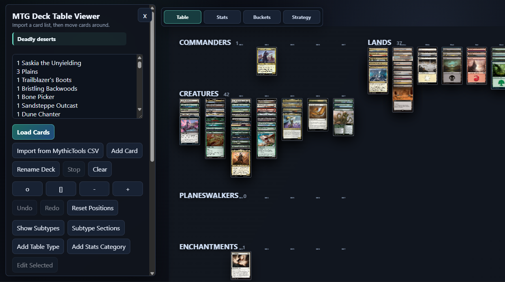
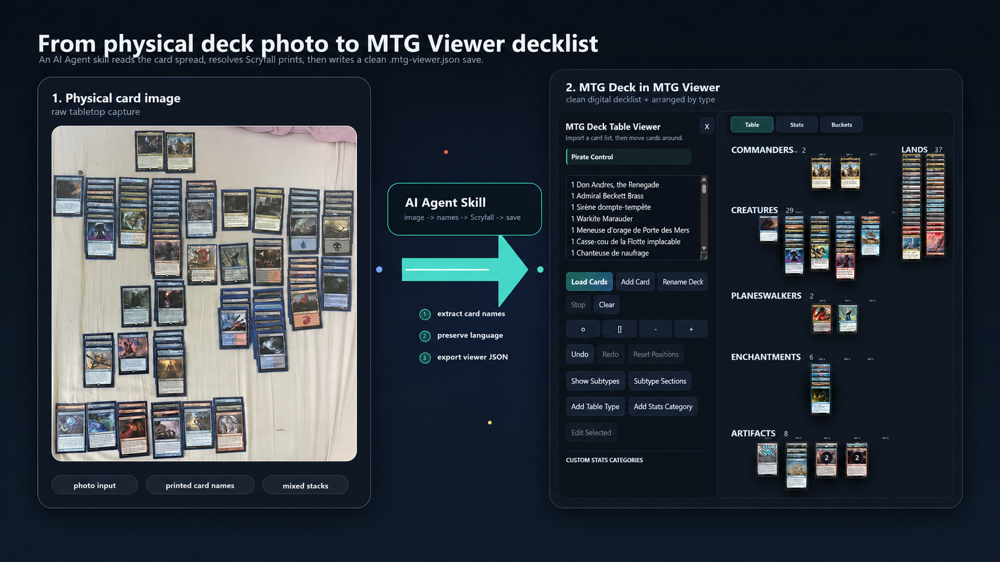

# MTG Deck Table Viewer

A zero-install, single-file HTML/CSS/JS application for organizing Magic: The Gathering Commander decks on an interactive digital tabletop.



## Features

- **Interactive Tabletop**: Drag and arrange cards across custom categories, land mana stacks, and utility buckets.
- **Scryfall Integration**: Resolves card text and exact printings via Scryfall IDs or `(SET) collector-number`, including printed-language images when specified.
- **Offline Mode**: Supports embedding card images directly into `.mtg-viewer.json` save files.
- **Granular Auto-Buckets**: Deterministically classifies card abilities into leaf categories (e.g. `damage/deal/creature`, `tokens/create/spirit`, `lands/react-to/enter-land`).
- **Strategy & Notes**: Attach piloting notes and generate deck strategy guides in Markdown.
- **Moxfield Export**: Export exact set/collector printings and foil/etched markers in Moxfield format.

## Usage

Simply open `mtg-viewer.html` in any web browser.

### Loading & Saving Decks

- Click **Open Deck File** to load an `.mtg-viewer.json` save file.
- Click **Save Deck File** to download or save your deck state.
- **Add Card** and **Load Cards** accept card names, plain Scryfall UUIDs, and Moxfield print syntax such as `1 Sol Ring (CMM) 410 *F*`.
- Viewer-generated decklist lines stay readable in Moxfield notation. The parser also accepts optional `| id=… | lang=… | finish=…` metadata, while JSON saves retain the complete Scryfall ID, language, finish, condition, altered, signed, and misprint fields invisibly.
- MythicTools CSV imports prefer Scryfall ID, then set + collector number + language, and only fall back to a name when no printing identifier is available.

### Strategy Notes

- Type freeform notes about how the deck plays.
- Notes are included in mtg-viewer JSON exports.

### Utility buckets view

- To edit buckets: right click on card or move card around categories.
- Click **Subcategories** to toggle fine-grained sub-bucket views for detailed role breakdowns.
- Click **Subcategory Rules** to edit, declare, clear, or restore default sub-bucket rules per utility category.
- Click on a card or category in the menu to focus the view.

## Notes

This is a static HTML/CSS/JavaScript app. It does not require a build step or store deck data on a server.

Save files are plain JSON with the `.mtg-viewer.json` extension. Browsers that support the File System Access API open a save-location dialog; other browsers use their normal download flow. Saves always keep image URLs; embedding images makes the file larger but lets imports show cards offline.

Card data and images are loaded from the public Scryfall API. Magic: The Gathering card names, text, and images belong to their respective rights holders.

## AI Agent Skills

The repo includes specialized AI agent skills under `agent-skills/`:

1. **mtg-deck-strategy-notes** (`agent-skills/mtg-deck-strategy-notes/`) — the recommended flagship skill:
   - Generates grounded Markdown strategy notes from compact current-format deck statistics and bounded card queries, using a fresh isolated Codex context for every deck without exposing the full save JSON to the LLM.

2. **mtg-viewer-from-deck-images** (`agent-skills/mtg-viewer-from-deck-images/`):
   - Guides an AI agent through creating `.mtg-viewer.json` saves from physical deck photos, including accent-preserving localized titles, language-preserving Scryfall images, duplicate audits, offline image embedding, multi-face card images, strategy note fields, actual/alternate commander fields, land produced-mana grouping, and utility bucket compatibility.
   - *Warning: this skill consumes a large amount of tokens. You might rather use specialised scanning tools instead, such as the scan feature from MythicTools (mtg-viewer compatible).*

3. **mtg-viewer-to-moxfield** (`agent-skills/mtg-viewer-to-moxfield/`):
   - Converts `.mtg-viewer.json` saved decks into paste-ready Moxfield decklists while preserving commander designations, quantities, set/collector printings, and foil/etched finishes. Legacy saves are enriched from their Scryfall IDs when online.



## License

This project is open source software licensed under the [MIT License](LICENSE).

## Citation & Attribution

If you use, adapt, or cite this project or its associated tools/skills in your work or software, please provide attribution and cite it as follows:

```bibtex
@misc{mtgviewer2026,
  author = {Gilles Gaël BERNARD},
  title = {MTG Deck Table Viewer},
  year = {2026},
  publisher = {GitHub},
  journal = {GitHub repository},
  howpublished = {\url{https://github.com/GillesGaelBERNARD/mtg-viewer}}
}
```

**Text reference:**
> BERNARD, Gilles Gaël. *MTG Deck Table Viewer* (2026). Available at: https://github.com/GillesGaelBERNARD/mtg-viewer
